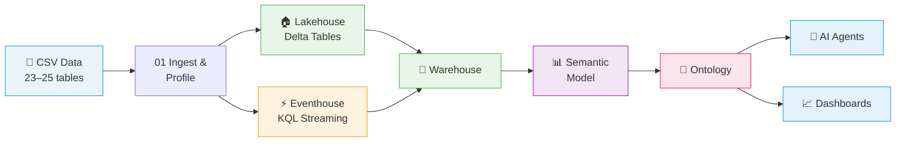
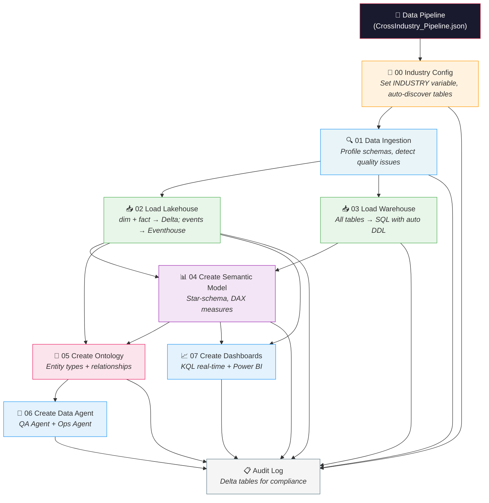
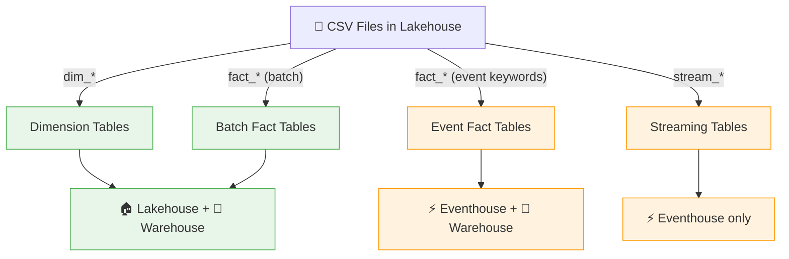

# FabricIQ Cross-Industry Accelerator

> **One pipeline. Ten industries. Full Fabric deployment in under an hour.**

An end-to-end accelerator for deploying **Microsoft Fabric Real-Time Intelligence** solutions across 10 industries. Run 8 parameterized notebooks and get a complete analytics stack — Lakehouse, Warehouse, Semantic Model, Ontology, AI Agents, and Dashboards — all wired together automatically.

Every industry tackles the same problem: **frontline workers spend 30–70% of their time on documentation** instead of their core job. This accelerator surfaces those burden metrics through automated pipelines, ontologies, AI agents, and real-time + batch dashboards.

---

## What You Get



| Output | What It Does |
|--------|-------------|
| **Lakehouse** | Delta tables for dimensions and batch facts |
| **Eventhouse** | KQL tables for real-time events and streaming data |
| **Warehouse** | All tables consolidated with auto-generated DDL |
| **Semantic Model** | Star-schema with auto-detected relationships and DAX measures |
| **Ontology** | Entity types, relationships, and contextualizations for Fabric IQ |
| **AI Agents** | QA Agent (ad-hoc questions) + Ops Agent (event monitoring) |
| **Dashboards** | Real-time KQL dashboard + Power BI report |

---

## Quick Start (5 Steps)

> **Prerequisites:** Microsoft Fabric workspace with capacity (F2+ or trial), Lakehouse, Warehouse, and Eventhouse already created.

### Step 1 — Pick Your Industry

| Industry Key | Industry | Tables | Dataset Folder |
|-------------|----------|--------|----------------|
| `healthcare` | 🏥 Healthcare (Nursing) | 25 | `healthcare_nursing_documentation/` |
| `construction` | 🏗️ Construction | 23 | `construction_site_operations/` |
| `finance` | 💰 Finance (Banking) | 23 | `finance_banking_operations/` |
| `retail` | 🛒 Retail | 23 | `retail_store_operations/` |
| `telecom` | 📡 Telecom | 23 | `telecom_network_operations/` |
| `insurance` | 🛡️ Insurance | 23 | `insurance_claims_operations/` |
| `law_firms` | ⚖️ Law Firms | 23 | `law_firm_operations/` |
| `media` | 📺 Media | 23 | `media_content_operations/` |
| `oil_and_gas` | 🛢️ Oil & Gas | 23 | `oil_gas_field_operations/` |
| `advertising` | 📢 Advertising | 23 | `advertising_campaign_operations/` |

### Step 2 — Upload Data

Upload the CSV files from `datasets/<your_industry>/data/` to your Lakehouse under `Files/<industry>_data/`.

### Step 3 — Configure

Open `00_Industry_Config.ipynb` and set your industry key and workspace values:

```python
INDUSTRY = "retail"  # Change to your industry key from Step 1

EVENTHOUSE_CLUSTER_URI = "https://<name>.<region>.kusto.fabric.microsoft.com"
EVENTHOUSE_DATABASE    = "<your_kql_database_name>"
```

### Step 4 — Run the Pipeline

Import all notebooks into your Fabric workspace and create a Data Pipeline:

**Recommended: Programmatic Deployment**
1. Upload `CrossIndustry_Pipeline.json` to your Lakehouse `Files/` folder
2. Run **`Deploy_Pipeline.ipynb`** notebook — it creates the pipeline via REST API automatically
3. Trigger the pipeline from Data Factory section

**Alternative: Manual Import**
1. Import `CrossIndustry_Pipeline.json` into Fabric workspace (Data Factory → Import)
2. Trigger the pipeline manually

Both provide:
- Visual orchestration with dependencies
- Built-in retry and timeout policies
- Centralized monitoring
- Full audit trail via Pipeline_Logger (persisted to Lakehouse)

After deployment:
- Monitor progress in the Fabric Monitoring hub
- Query audit logs: `SELECT * FROM dbo.pipeline_runs ORDER BY start_time DESC`



### Step 5 — Explore

- Ask the **QA Agent**: *"Which workers had the most overtime this month?"*
- Ask the **Ops Agent**: *"Show me burnout risk trends by unit"*
- Open the **KQL Dashboard** for live streaming metrics (30-second auto-refresh)
- Open the **Power BI Report** for historical analysis and drill-downs

---

## Repository Structure

```
fabriciq-cross-industry/
│
├── cross_industry_notebooks/       ← 🚀 START HERE
│   ├── Pipeline_Logger.ipynb       # Centralized audit & telemetry engine
│   ├── 00_Industry_Config.ipynb    # Set industry key + auto-discover tables
│   ├── 01–07_*.ipynb               # Core pipeline (run in order)
│   ├── *_Agent_Instructions.ipynb  # Industry-specific agent prompts
│   └── ZT_Security_Utils.ipynb     # Zero Trust security (auto-loaded)
│
├── CrossIndustry_Pipeline.json     ← 📋 Fabric Data Pipeline definition
│
└── datasets/                       ← 📁 Sample data for all 10 industries
    └── <industry>/
        └── data/                   # dim_*.csv, fact_*.csv, stream_*.csv
```

---

## How Data Flows

CSV files are automatically classified by their filename prefix and routed to the appropriate storage:



> **Auto-detection:** Fact tables containing event keywords (`_events`, `_clickstream`, `_alerts`, `_vital`, etc.) are automatically routed to the Eventhouse.

---

## Built-In Security

Every notebook automatically loads `ZT_Security_Utils.ipynb` which enforces **Zero Trust for AI** principles:

| Principle | What It Does |
|-----------|-------------|
| **Verify Explicitly** | Input validation, column name sanitization, URL allowlists |
| **Least Privilege** | Table allowlists, sensitive column filtering, data scoping |
| **Assume Breach** | Audit logging, prompt injection detection, injection pattern defense |

No configuration needed — it's included via `%run ./ZT_Security_Utils` in every pipeline notebook.

---

## Industries at a Glance

Each industry targets a specific documentation burden problem:

| Industry | Burden | Lost Time |
|----------|--------|-----------|
| 🏥 Healthcare | Nursing charting | 40–60% of shift on EHR documentation |
| 🏗️ Construction | Daily logs, RFIs | 30–50% on paperwork |
| 💰 Finance | KYC/AML compliance | 40–60% on regulatory forms |
| 🛒 Retail | Store reports | 30–50% admin; 12–18 reports/week |
| 📡 Telecom | Tickets & RCAs | 35–55% on documentation |
| 🛡️ Insurance | Claims processing | 50–70% on forms; 8–15 docs/claim |
| ⚖️ Law Firms | Legal documents | 40–60%; $150K–$500K lost/attorney/year |
| 📺 Media | Metadata & rights | 30–50% on clearance docs |
| 🛢️ Oil & Gas | DDRs & permits | 40–60% on field paperwork |
| 📢 Advertising | Campaign docs | 35–55% of AE time |

---

## Quick Start

**Set one variable. Deploy in 30 minutes.**

1. Set `INDUSTRY = "healthcare"` (or any of 10 industries) in `00_Industry_Config.ipynb`
2. Run `Deploy_Pipeline.ipynb` to create the Data Pipeline
3. Trigger pipeline from Fabric UI

See [cross_industry_notebooks/README.md](cross_industry_notebooks/README.md) for full deployment guide.

---

## Troubleshooting

<details>
<summary><b>Common Issues & Fixes</b> (click to expand)</summary>

| Problem | Fix |
|---------|-----|
| `ERROR: Path not found` | Upload CSVs to `Files/<industry>_data/` in your Lakehouse |
| Eventhouse cells skipped | Set `EVENTHOUSE_CLUSTER_URI` and `EVENTHOUSE_DATABASE` in config notebook |
| Ontology creation fails | Ensure `.whl` and `.iq` files are uploaded to Lakehouse `Files/` |
| Warehouse DDL errors | Verify the Warehouse exists and notebook has connectivity |
| Semantic model API error | Import the TMSL JSON manually via Power BI Desktop as a fallback |
| Agent creation 403 | Workspace permissions must be Contributor or higher |
| No tables discovered | CSV files must start with `dim_`, `fact_`, or `stream_` |

</details>

---

## License

This project is licensed under the MIT License. See [LICENSE](LICENSE) for details.
