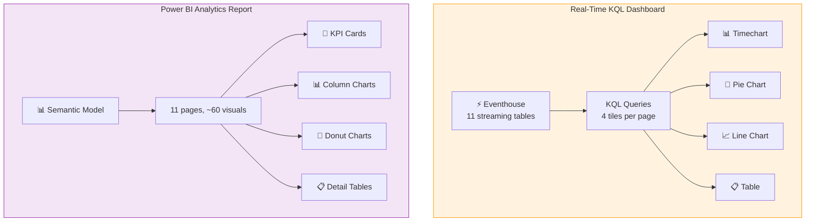

# Dashboard Visuals Guide — Advertising Campaign Operations

> **Reference document** for every page and visual generated by `07_Create_Dashboards.ipynb` for the Advertising industry.

Two dashboards are created — one for live operations, one for historical analysis:

| Dashboard | Technology | Data Source | Purpose |
|---|---|---|---|
| **Advertising_RealTime_Dashboard** | KQL Dashboard | Eventhouse (streaming) | Live monitoring, 30s auto-refresh |
| **Advertising_Analytics_Report** | Power BI (PBIR-Legacy) | Semantic Model / Warehouse | Historical KPIs, drill-down |

---

## Quick Navigation

**Real-Time KQL Dashboard (11 pages):**
[OMS Interactions](#page-1--oms-interactions) | [Contract Changes](#page-2--contract-changes) | [Proof Approvals](#page-3--proof-approvals) | [Work Orders](#page-4--work-orders) | [POP Alerts](#page-5--pop-alerts) | [Inventory Tracking](#page-6--inventory-tracking) | [Campaign Pacing](#page-7--campaign-pacing) | [Creative Status](#page-8--creative-status) | [Installation Events](#page-9--installation-events) | [Digital Impressions](#page-10--digital-impressions) | [Inventory Availability](#page-11--inventory-availability)

**Power BI Analytics Report (11 pages):**
[Executive Summary](#page-1--executive-summary) | [Campaign Orders](#page-2--campaign-orders) | [Charting Events](#page-3--charting-events) | [POP Reports](#page-4--pop-reports) | [AE Wellness](#page-5--ae-wellness) | [Production Quality](#page-6--production-quality) | [Advertiser Satisfaction](#page-7--advertiser-satisfaction) | [OMS Interactions](#page-8--oms-interactions) | [Contract Changes](#page-9--contract-changes) | [Proof Approvals](#page-10--proof-approvals)

---

## Dashboard Architecture



---

## 1. Real-Time KQL Dashboard

**Name:** `Advertising_RealTime_Dashboard`
**Format:** KQL Dashboard (schema_version 63)
**Data Source:** Eventhouse — `Advertising_DocBurden_Eventhouse`
**Refresh:** 30-second auto-refresh
**Pages:** 11 (one per Eventhouse streaming/event table)

### Tile Pattern (Repeats Per Page)

Every page follows the same 4-tile layout:

```
┌─────────────────────────────────────────────┐
│  📊 Timechart           │  🥧 Pie Chart     │
│  Events over time       │  By category       │
│  (count by bin 1h)      │  (top 10)          │
├─────────────────────────┼────────────────────┤
│  📈 Line Chart          │  📋 Table          │
│  Avg metric trend       │  Latest 20 events  │
│  (avg by bin 1h)        │  (order by time)   │
└─────────────────────────┴────────────────────┘
```

| Tile # | Visual | KQL Pattern |
|--------|--------|-------------|
| 1 | Timechart | `<table> \| summarize count() by bin(timestamp, 1h)` |
| 2 | Pie Chart | `<table> \| summarize count() by <first_categorical> \| top 10` |
| 3 | Line Chart | `<table> \| summarize avg(<first_numeric>) by bin(timestamp, 1h)` |
| 4 | Table | `<table> \| top 20 by timestamp desc` |

### Page 1 — OMS Interactions

**📋 Purpose:** Tracks system interactions by account executives in the Order Management System to identify bottlenecks and training needs.

**💡 Why It Matters:** High response times indicate system performance issues or workflow inefficiencies. Understanding which modules consume the most time helps prioritize system improvements and identify AEs who may need additional training.

**👀 What to Look For:**
- **Spikes in event volume** → System load issues or campaign deadlines
- **Duration_ms trending up** → Performance degradation or complex workflows
- **Module concentration** → Certain modules dominating usage (potential workflow bottlenecks)
- **Action patterns** → Repetitive actions that could be automated

**🎯 Actionable Insights:**
- If `module` = "contract_entry" has high duration → Simplify contract forms
- If certain `action` types appear frequently → Candidates for automation
- If duration varies by AE → Training opportunity for slower users

| Tile | Title | KQL Summary | **Speaker Notes** |
|------|-------|-------------|-------------------|
| Timechart | Events Over Time | `oms_interactions \| summarize count() by bin(timestamp, 1h)` | **Interpretation:** Peaks during business hours (9AM-5PM) are normal. After-hours spikes may indicate mounting workload or deadline pressure. Compare weekday vs weekend patterns. |
| Pie Chart | By module | Count by `module` — which OMS modules are used most | **Interpretation:** Top 3 modules should align with primary workflow. If "reports" or "search" dominate, users may be struggling to find data. Balance across modules = healthy workflow. | 
| Line Chart | Avg Duration (ms) Trend | `avg(duration_ms) by bin(timestamp, 1h)` | **Interpretation:** Baseline should be <2000ms. Sustained increases indicate system degradation. Sudden jumps correlate with release deployments. Monitor for 3+ consecutive hours above baseline. |
| Table | Latest Events | Top 20 rows: `interaction_id, ae_id, timestamp, system, module, action, duration_ms, campaign_id` | **Interpretation:** Scan for outliers (duration_ms >10000). Identify AEs with repeated slow actions. Check if complex campaigns correlate with higher duration. |

**Key columns:** `duration_ms` (system response time), `module` (OMS module), `action` (user action), `system` (source system)

### Page 2 — Contract Changes

**📋 Purpose:** Monitors campaign contract change notices (CCNs) flowing through the system to track scope creep and revenue impact.

**💡 Why It Matters:** CCNs are a leading indicator of campaign complexity and documentation burden. High CCN volumes correlate with AE burnout and advertiser dissatisfaction. Each CCN requires documentation averaging 15-45 minutes.

**👀 What to Look For:**
- **High change_type concentration** → Systematic issues (e.g., too many "unit_swap" = inventory problems)
- **Revenue_impact negative trends** → Budget reductions or campaign cancellations
- **doc_time_min increasing** → Process inefficiency or complexity creep
- **approval_status = pending >48hrs** → Bottlenecks in approval chain

**🎯 Actionable Insights:**
- If `change_type` = "unit_swap" >30% → Investigate inventory forecasting accuracy
- If `revenue_impact` consistently negative → Review pricing strategy and contract terms
- If `doc_time_min` >30min average → Simplify forms or provide templates

| Tile | Title | KQL Summary | **Speaker Notes** |
|------|-------|-------------|-------------------|
| Timechart | Events Over Time | `contract_changes \| summarize count() by bin(timestamp, 1h)` | **Interpretation:** Baseline CCN rate is ~5-10/day. Spikes often follow campaign launches (Week 1) or midpoint reviews (Week 4-6). End-of-quarter spikes signal budget adjustments. |
| Pie Chart | By change_type | Count by `change_type` — types of contract modifications | **Interpretation:** Healthy mix = 40% extensions, 30% unit adjustments, 20% pricing, 10% other. If "cancellation" >15%, investigate client satisfaction. If "unit_swap" dominates, audit inventory quality. |
| Line Chart | Avg Units Affected Trend | `avg(units_affected) by bin(timestamp, 1h)` | **Interpretation:** Baseline ~5-10 units. Values >20 indicate major scope changes. Sustained upward trend = inadequate upfront planning. Correlate with revenue_impact to assess severity. |
| Table | Latest Events | Top 20 rows: `ccn_id, campaign_id, ae_id, timestamp, change_type, units_affected, revenue_impact, doc_time_min, approval_status` | **Interpretation:** Filter for `approval_status` = "pending" >48 hours. Identify AEs with highest CCN frequency (top 5% may need coaching). Check if specific campaigns generate disproportionate changes. |

**Key columns:** `change_type`, `units_affected`, `revenue_impact`, `doc_time_min` (documentation burden), `approval_status`

### Page 3 — Proof Approvals

**📋 Purpose:** Tracks creative proof approval workflows to identify bottlenecks and reduce time-to-market for campaigns.

**💡 Why It Matters:** Proof approval cycle time directly impacts campaign launch dates and revenue recognition. Industry benchmark is <24 hours per proof iteration. Delays cascade through production schedules.

**👀 What to Look For:**
- **cycle_time_hours >48** → Reviewer backlog or unclear approval criteria
- **revision_count >3** → Poor initial creative quality or misaligned expectations
- **proof_type imbalance** → Certain formats requiring disproportionate reviews
- **status = rejected patterns** → Systematic quality issues

**🎯 Actionable Insights:**
- If `cycle_time_hours` >48hrs consistently → Add more reviewers or set SLA alerts
- If `revision_count` >3 for specific AEs → Provide creative brief templates
- If `proof_type` = "digital" has longest cycle → May need specialized digital reviewer

| Tile | Title | KQL Summary | **Speaker Notes** |
|------|-------|-------------|-------------------|
| Timechart | Events Over Time | `proof_approvals \| summarize count() by bin(timestamp, 1h)` | **Interpretation:** Peak submission times are Mon-Wed mornings (planning meetings). Thursday-Friday drops = weekend production avoidance. Monitor for after-hours submissions (burnout indicator). |
| Pie Chart | By proof_type | Count by `proof_type` — types of proofs submitted | **Interpretation:** Should align with media mix: OOH 40-50%, digital 30-40%, print 10-20%. Imbalance suggests channel shift or portfolio problems. Track proof_type evolution over quarters. |
| Line Chart | Avg Cycle Time (Hours) Trend | `avg(cycle_time_hours) by bin(timestamp, 1h)` | **Interpretation:** Target <24hrs. 24-48hrs = acceptable. >48hrs = escalation needed. Weekly pattern: Mon/Tue fastest (reviewer availability), Thu/Fri slowest (weekend backlog). Set alert at 72hrs. |
| Table | Latest Events | Top 20 rows: `approval_id, order_id, ae_id, timestamp, proof_type, status, reviewer, cycle_time_hours, revision_count` | **Interpretation:** Sort by cycle_time_hours descending to identify stuck proofs. Check if specific reviewers are bottlenecks. Revision_count >5 = escalate to creative director for quality review. |

**Key columns:** `proof_type`, `status`, `cycle_time_hours` (approval turnaround), `revision_count`

### Page 4 — Work Orders

**📋 Purpose:** Monitors field installation work orders to ensure timely campaign execution and track documentation overhead.

**💡 Why It Matters:** Work orders are the final step in campaign activation. Install delays impact guaranteed impression dates and revenue recognition. Documentation time is pure overhead for production teams.

**👀 What to Look For:**
- **wo_type = "repair" increasing** → Asset quality issues or vandalism patterns
- **install_status = "delayed" >10%** → Vendor capacity problems or permitting issues
- **doc_time_min >45min** → Complex posting instructions or system usability issues
- **Vendor_id concentration** → Over-reliance on single vendor (risk)

**🎯 Actionable Insights:**
- If `wo_type` = "repair" >20% of volume → Asset durability audit needed
- If specific `vendor_id` has high delays → Re-negotiate SLAs or add backup vendors
- If `doc_time_min` varies widely by AE → Standardize posting instruction templates

| Tile | Title | KQL Summary | **Speaker Notes** |
|------|-------|-------------|-------------------|
| Timechart | Events Over Time | `work_orders \| summarize count() by bin(timestamp, 1h)` | **Interpretation:** Volume clusters Monday mornings (weekend installs) and month-end (campaign launches). Summer peaks for seasonal campaigns. Low volume = capacity for rush orders. |
| Pie Chart | By wo_type | Count by `wo_type` — install, remove, repair, etc. | **Interpretation:** Healthy mix: 50-60% new installs, 30-40% removals, <10% repairs. High repair rate signals asset aging or location quality issues. Track ratio over time for maintenance budget planning. |
| Line Chart | Avg Doc Time (Min) Trend | `avg(doc_time_min) by bin(timestamp, 1h)` | **Interpretation:** Baseline ~20-30 min per WO. >45min = overly complex instructions. <15min may indicate insufficient detail (quality risk). Trend up = process bloat; trend down = process improvement success. |
| Table | Latest Events | Top 20 rows: `wo_id, campaign_id, unit_id, timestamp, wo_type, posting_instructions, vendor_id, install_status, doc_time_min` | **Interpretation:** Filter `install_status` != "completed" to find stuck work orders. Check if `posting_instructions` length correlates with doc_time_min. Identify vendors with completion rates <95%. |

**Key columns:** `wo_type`, `install_status`, `doc_time_min` (documentation time), `vendor_id`

### Page 5 — POP Alerts

**📋 Purpose:** Proof-of-Performance alert monitoring identifies compliance issues that risk makegoods and revenue recovery.

**💡 Why It Matters:** POP documentation proves campaign delivery and protects against advertiser disputes. Missing photos trigger makegoods (free impressions) costing $50K-$500K per campaign. Industry standard is <3% POP failure rate.

**👀 What to Look For:**
- **alert_type = "missing_photo" >5%** → Field crew process failure or equipment issues
- **severity = "critical" unresolved >24hrs** → Immediate makegood liability
- **photos_missing trending up** → Systematic process breakdown
- **resolution_status = "unresolved" aging** → Growing compliance debt

**🎯 Actionable Insights:**
- If `alert_type` = "expired_posting" clusters in specific markets → Local permitting issues
- If `photos_missing` correlates with specific vendors → Training or contract enforcement needed
- If alerts spike post-installation → Quality check process gap (catch at install time)

| Tile | Title | KQL Summary | **Speaker Notes** |
|------|-------|-------------|-------------------|
| Timechart | Events Over Time | `pop_alerts \| summarize count() by bin(timestamp, 1h)` | **Interpretation:** Baseline <5 alerts/day. Spikes follow campaign activations (Day 7-10 post-install = first audit cycle). Month-end spikes = advertiser report deadlines driving audits. Zero alerts = audit process not running. |
| Pie Chart | By alert_type | Count by `alert_type` — missing photos, expired posting, etc. | **Interpretation:** Target: <60% missing photos (easily fixable), <30% quality issues, <10% critical issues. If "damaged_asset" >15%, investigate vandalism patterns or asset durability. |
| Line Chart | Avg Photos Missing Trend | `avg(photos_missing) by bin(timestamp, 1h)` | **Interpretation:** Benchmark: <0.5 photos/campaign. Per POP requires 1-4 photos (proof of posting). Values >1.0 = compliance risk. Sustained increase = field process deterioration or training gap. |
| Table | Latest Events | Top 20 rows: `alert_id, campaign_id, unit_id, timestamp, alert_type, severity, description, photos_missing, resolution_status` | **Interpretation:** Priority queue: Filter severity="critical" + resolution_status="unresolved". Check campaign_id for high-value advertisers (priority resolution). Track time-to-resolution: <24hrs for critical, <72hrs for high. |

**Key columns:** `alert_type`, `severity`, `photos_missing`, `resolution_status`

### Page 6 — Inventory Tracking

**📋 Purpose:** Tracks advertising unit inventory status changes to maintain accurate availability and prevent double-booking.

**💡 Why It Matters:** Inventory accuracy is critical for sales forecasting and revenue protection. Overbooking leads to makegoods; underbooking leaves revenue on the table. Real-time tracking prevents both.

**👀 What to Look For:**
- **event_type = "status_change" frequency** → Churn rate indicates market volatility
- **previous_status → new_status patterns** → Unusual transitions (e.g., sold → available = cancellation)
- **doc_time_min >30min** → Complex status workflows need simplification
- **Market_id hotspots** → High-demand markets with frequent changes

**🎯 Actionable Insights:**
- If `new_status` = "maintenance" increasing → Asset aging; plan capital refresh
- If `reason` = "cancellation" >10% → Client satisfaction or pricing issues
- If `doc_time_min` varies by market → Process standardization needed

| Tile | Title | KQL Summary | **Speaker Notes** |
|------|-------|-------------|-------------------|
| Timechart | Events Over Time | `inventory_tracking \| summarize count() by bin(timestamp, 1h)` | **Interpretation:** Baseline 50-100 changes/day. Monday spikes = weekend changes processed. End-of-month peaks = contract renewals and expirations. Low activity may indicate stale data. |
| Pie Chart | By event_type | Count by `event_type` — status transitions for ad units | **Interpretation:** Healthy distribution: 40-50% availability updates, 30-40% bookings, 10-20% releases, <10% maintenance. High maintenance = aging asset base. Track event_type mix quarterly. |
| Line Chart | Avg Doc Time (Min) Trend | `avg(doc_time_min) by bin(timestamp, 1h)` | **Interpretation:** Target <20min per status change. >30min = workflow friction or data quality issues requiring manual cleanup. Decreased time = automation success. Monitor for sudden increases (system issues). |
| Table | Latest Events | Top 20 rows: `tracking_id, unit_id, timestamp, event_type, market_id, previous_status, new_status, reason, doc_time_min` | **Interpretation:** Look for rapid state transitions (same unit_id with <1hr between changes = data quality issue). Check if high-value markets (top revenue) show unusual patterns. Audit “reason” for cancellations. |

**Key columns:** `event_type`, `previous_status`, `new_status`, `reason`, `doc_time_min`

### Page 7 — Campaign Pacing

**📋 Purpose:** Real-time campaign delivery pacing vs targets ensures guaranteed impressions are met and budgets are optimized.

**💡 Why It Matters:** Pacing determines revenue recognition timing and advertiser satisfaction. Under-delivery triggers makegoods; over-delivery erodes margins. Industry target is ±5% of plan.

**👀 What to Look For:**
- **pacing_status = "behind" >20%** → Risk of makegoods and contract penalties
- **pacing_status = "ahead" sustained** → Burning budget too fast (margin erosion)
- **impressions_delivered vs impressions_target gap widening** → Forecasting inaccuracy
- **spend_pct >100% before campaign end** → Budget overrun risk

**🎯 Actionable Insights:**
- If `pacing_status` = "behind" for premium campaigns → Add inventory or extend contract
- If `spend_pct` significantly outpaces delivery → Cost per impression higher than planned
- If consistent "ahead" pacing → Opportunity to upsell additional impressions

| Tile | Title | KQL Summary | **Speaker Notes** |
|------|-------|-------------|-------------------|
| Timechart | Events Over Time | `campaign_pacing \| summarize count() by bin(timestamp, 1h)` | **Interpretation:** Pacing checks occur every 4-24 hours depending on campaign cadence. Daily campaigns show 24 events/day. Gaps >24hrs indicate monitoring issues. Frequency increases near campaign end (hourly checks). |
| Pie Chart | By pacing_status | Count by `pacing_status` — on_track, behind, ahead | **Interpretation:** Target: 70-80% on_track, 10-15% behind, 10-15% ahead. >25% behind = systemic delivery issues. >25% ahead = over-delivering (margin concern). Track status distribution weekly. |
| Line Chart | Avg Impressions Delivered Trend | `avg(impressions_delivered) by bin(timestamp, 1h)` | **Interpretation:** Should show steady linear growth matching flight dates. Flat periods = no delivery (investigate units). Steep curves = burst delivery (check inventory allocation). Compare to impressions_target line. |
| Table | Latest Events | Top 20 rows: `pacing_id, campaign_id, timestamp, impressions_delivered, impressions_target, spend_pct, pacing_status` | **Interpretation:** Priority: Filter pacing_status!="on_track" + (impressions_delivered / impressions_target) <0.80. These campaigns need immediate attention. Check if spend_pct > delivery % (cost overrun). |

**Key columns:** `impressions_delivered`, `impressions_target`, `spend_pct`, `pacing_status`

### Page 8 — Creative Status

**📋 Purpose:** Tracks creative asset lifecycle through proof stages to prevent launch delays and identify production bottlenecks.

**💡 Why It Matters:** Creative status directly impacts campaign go-live dates and revenue recognition. Assets stuck in proof stages delay launches and cascade through the production schedule.

**👀 What to Look For:**
- **creative_status = "pending_review" aging >48hrs** → Review bottleneck
- **proof_stage stuck at 1st/2nd review** → Quality issues or unclear briefs
- **days_pending >7** → Risk of missing campaign start date
- **blocker_type patterns** → Systematic issues (legal, brand approval, etc.)

**🎯 Actionable Insights:**
- If `creative_status` stuck at "pending_legal" → Add legal review capacity or pre-clear claims
- If `days_pending` correlates with specific creative types → Adjust timelines or templates
- If `blocker_type` = "client_feedback" dominates → Improve initial brief process

| Tile | Title | KQL Summary | **Speaker Notes** |
|------|-------|-------------|-------------------|
| Timechart | Events Over Time | `creative_status \| summarize count() by bin(timestamp, 1h)` | **Interpretation:** Status updates occur at each workflow stage. Baseline 20-40 updates/day. Lack of movement indicates stalled pipeline. Increased velocity near launch deadlines (last-minute changes). |
| Pie Chart | By creative_status | Count by `creative_status` — the current state of each creative | **Interpretation:** Healthy funnel: 40% in_progress, 30% pending_review, 20% approved, 10% production. If >30% pending_review = bottleneck. If <20% approved near launch dates = risk. |
| Line Chart | Avg Days Pending Trend | `avg(days_pending) by bin(timestamp, 1h)` | **Interpretation:** Target <3 days per stage, <10 days total cycle. >7 days indicates inefficiency. Trend up = process degradation. Trend down = improvement. Compare to proof_stage for stage-specific analysis. |
| Table | Latest Events | Top 20 rows: `status_id, order_id, campaign_id, timestamp, creative_status, proof_stage, days_pending, blocker_type` | **Interpretation:** Filter days_pending >7 to identify at-risk assets. Group by blocker_type to find patterns. Check if campaigns with days_pending >14 still have realistic launch dates. Escalate to production manager. |

**Key columns:** `creative_status`, `proof_stage`, `days_pending`, `blocker_type`

### Page 9 — Installation Events

Field crew installation event tracking with GPS and photo upload status.

| Tile | Title | KQL Summary |
|------|-------|-------------|
| Timechart | Events Over Time | `installation_events \| summarize count() by bin(timestamp, 1h)` |
| Pie Chart | By event_type | Count by `event_type` — started, completed, failed |
| Line Chart | Avg GPS Lat Trend | `avg(gps_lat) by bin(timestamp, 1h)` |
| Table | Latest Events | Top 20 rows: `event_id, wo_id, unit_id, timestamp, event_type, crew_id, status, photo_uploaded, gps_lat, gps_lng` |

**Key columns:** `event_type`, `status`, `photo_uploaded`, `crew_id`

### Page 10 — Digital Impressions

Digital ad impression delivery monitoring.

| Tile | Title | KQL Summary |
|------|-------|-------------|
| Timechart | Events Over Time | `digital_impressions \| summarize count() by bin(timestamp, 1h)` |
| Pie Chart | By audience_segment | Count by `audience_segment` — targeted audience groups |
| Line Chart | Avg Impressions Count Trend | `avg(impressions_count) by bin(timestamp, 1h)` |
| Table | Latest Events | Top 20 rows: `impression_id, campaign_id, unit_id, timestamp, impressions_count, dwell_time_sec, audience_segment` |

**Key columns:** `impressions_count`, `dwell_time_sec`, `audience_segment`

### Page 11 — Inventory Availability

Real-time inventory availability and hold status.

| Tile | Title | KQL Summary |
|------|-------|-------------|
| Timechart | Events Over Time | `inventory_availability \| summarize count() by bin(timestamp, 1h)` |
| Pie Chart | By availability_status | Count by `availability_status` — available, held, sold |
| Line Chart | Avg Days Available Trend | `avg(days_available) by bin(timestamp, 1h)` |
| Table | Latest Events | Top 20 rows: `avail_id, unit_id, market_id, timestamp, availability_status, hold_type, campaign_id, days_available` |

**Key columns:** `availability_status`, `hold_type`, `days_available`

---

## 2. Power BI Analytics Report

**Name:** `Advertising_Analytics_Report`
**Format:** PBIR-Legacy (definition.pbir + report.json)
**Data Source:** Semantic Model — `Advertising_DocBurden_Model`
**Pages:** 11 (Executive Summary + 10 per-table pages)
**Total Visuals:** ~60

### Visual Types Used

| Visual Type | Icon | Purpose |
|-------------|------|---------|
| **Card** | Single number | KPI headline metric (colored accent font) |
| **Clustered Column Chart** | Vertical bars | Compare metric across categories |
| **Bar Chart** | Horizontal bars | Ranked category comparison |
| **Line Chart** | Trend line | Metric trend over time (date axis) |
| **Donut Chart** | Ring chart | Category distribution / proportions |
| **Table** | Grid | Detail rows with multiple columns |

### Page Layout Pattern

Each Power BI page uses a **1280x720** canvas with a consistent 3-row layout:

```
┌──────────────────────────────────────────────────────────────┐
│  Row 1: KPI Cards (up to 4 colored cards)                    │
│  ┌──────────┐ ┌──────────┐ ┌──────────┐ ┌──────────┐       │
│  │ 🔵 Card  │ │ 🔷 Card  │ │ 🟠 Card  │ │ 🟣 Card  │       │
│  │  Sum/Avg  │ │  Sum/Avg  │ │  Sum/Avg  │ │  Sum/Avg  │       │
│  └──────────┘ └──────────┘ └──────────┘ └──────────┘       │
├──────────────────────────┬───────────────────────────────────┤
│  Row 2: Charts           │                                   │
│  Column/Bar Chart        │  Line Chart or Donut              │
│  (category × metric)     │  (trend or distribution)          │
├──────────────────────────┼───────────────────────────────────┤
│  Row 3: Details          │                                   │
│  Donut Chart             │  Detail Table (7-8 columns)       │
│  (if categorical exists) │  (raw records)                    │
└──────────────────────────┴───────────────────────────────────┘
```
### Color Palette

KPI cards use the Power BI accent palette for visual distinction:

| Position | Color | Hex |
|----------|-------|-----|
| Card 1 | Blue | `#118DFF` |
| Card 2 | Navy | `#12239E` |
| Card 3 | Orange | `#E66C37` |
| Card 4 | Purple | `#6B007B` |

### Smart Aggregation Logic

Numeric columns are automatically aggregated using semantic rules:

- **Sum** — quantity columns: `units_*`, `hours`, `count`, `impressions`, `revenue`, `spend`, `photos_*`
- **Avg** — rate/score columns: `*_pct`, `*_score`, `*_rate`, `accuracy`, `likelihood`, `balance`, `satisfaction`, `fatigue`, `burden`, `pressure`

---

### Page 1 — Executive Summary

The landing page with cross-table KPI highlights and headline charts.

**Row 1: KPI Cards (4 colored cards)**

| Card | Source Table | Metric | Aggregation | Color |
|------|-------------|--------|-------------|-------|
| 1 | `fact_campaign_orders` | `units_booked` | Sum | Blue `#118DFF` |
| 2 | `fact_charting_events` | `units_charted` | Sum | Navy `#12239E` |
| 3 | `fact_pop_reports` | `units_verified` | Sum | Orange `#E66C37` |
| 4 | `fact_ae_wellness` | `admin_burden_score` | Avg | Purple `#6B007B` |

**Row 2: Column Chart + Donut**

| Visual | Source Table | Category Axis | Value | Aggregation |
|--------|-------------|---------------|-------|-------------|
| Column Chart | `fact_campaign_orders` | `order_type` | `units_booked` | Sum |
| Donut Chart | `fact_charting_events` | `charting_type` | `units_charted` | Sum |

**Row 3: Line Chart + Bar Chart**

| Visual | Source Table | Axis | Value | Aggregation |
|--------|-------------|------|-------|-------------|
| Line Chart | `fact_campaign_orders` | `date` | `units_booked` | Sum |
| Bar Chart | `fact_charting_events` | `charting_type` | `manual_charts` | Sum |

---

### Page 2 — Campaign Orders

Tracks advertising campaign order volumes, booking patterns, and documentation burden.

| Visual | Type | Columns | Notes |
|--------|------|---------|-------|
| Card 1 | Card (Blue) | `Sum(units_booked)` | Total units booked across all orders |
| Card 2 | Card (Navy) | `Sum(doc_time_min)` | Total documentation time in minutes |
| Card 3 | Card (Orange) | `Sum(proof_cycles)` | Total proof revision cycles |
| Column Chart | Clustered Column | `order_type` × `Sum(units_booked)` | Units booked by order type |
| Line Chart | Line | `date` × `Sum(units_booked)` | Booking trend over time |
| Donut Chart | Donut | `order_type` × `Sum(doc_time_min)` | Doc time distribution by order type |
| Detail Table | Table | `order_id, campaign_id, ae_id, date, order_type, units_booked, doc_time_min` | Raw order records |

**Schema:** `order_id, campaign_id, ae_id, date, order_type, units_booked, doc_time_min, proof_cycles, status, production_vendor_id`

---

### Page 3 — Charting Events

Monitors chart creation activity — manual vs automated charting and CCN flag rates.

| Visual | Type | Columns | Notes |
|--------|------|---------|-------|
| Card 1 | Card (Blue) | `Sum(units_charted)` | Total units charted |
| Card 2 | Card (Navy) | `Sum(manual_charts)` | Manual chart count |
| Card 3 | Card (Orange) | `Sum(auto_charts)` | Automated chart count |
| Column Chart | Clustered Column | `charting_type` × `Sum(units_charted)` | Volume by charting type |
| Line Chart | Line | `date` × `Sum(units_charted)` | Charting activity trend |
| Donut Chart | Donut | `charting_type` × `Sum(manual_charts)` | Manual chart distribution |
| Detail Table | Table | `charting_id, campaign_id, chartist_id, date, charting_type, units_charted, manual_charts` | Raw charting records |

**Schema:** `charting_id, campaign_id, chartist_id, date, charting_type, units_charted, manual_charts, auto_charts, doc_time_min, ccn_flag`

---

### Page 4 — POP Reports

Proof-of-Performance compliance reporting — photo submission and verification rates.

| Visual | Type | Columns | Notes |
|--------|------|---------|-------|
| Card 1 | Card (Blue) | `Sum(units_verified)` | Total verified units |
| Card 2 | Card (Navy) | `Sum(photos_required)` | Total photos required |
| Card 3 | Card (Orange) | `Sum(photos_submitted)` | Total photos submitted |
| Line Chart | Line | `date` × `Sum(units_verified)` | Verification trend |
| Detail Table | Table | `pop_id, campaign_id, ae_id, date, units_verified, photos_required, photos_submitted` | Full-width table (no categorical column → no column chart or donut) |

**Schema:** `pop_id, campaign_id, ae_id, date, units_verified, photos_required, photos_submitted, compliance_pct, doc_time_min`

---

### Page 5 — AE Wellness

Account Executive wellness and workload balance — burnout risk indicators.

| Visual | Type | Columns | Notes |
|--------|------|---------|-------|
| Card 1 | Card (Blue) | `Avg(admin_burden_score)` | Average admin burden score |
| Card 2 | Card (Navy) | `Avg(quota_pressure_score)` | Average quota pressure |
| Card 3 | Card (Orange) | `Sum(overtime_hours)` | Total overtime hours logged |
| Line Chart | Line | `date` × `Avg(admin_burden_score)` | Burden score trend |
| Detail Table | Table | `survey_id, ae_id, date, admin_burden_score, quota_pressure_score, overtime_hours, after_hours_doc_min` | Full-width table (no categorical column) |

**Schema:** `survey_id, ae_id, date, admin_burden_score, quota_pressure_score, overtime_hours, after_hours_doc_min, fatigue_score, work_life_balance`

---

### Page 6 — Production Quality

Quality metrics for campaign production — charting accuracy, proof approvals, install timeliness.

| Visual | Type | Columns | Notes |
|--------|------|---------|-------|
| Card 1 | Card (Blue) | `Avg(charting_accuracy_pct)` | Average charting accuracy |
| Card 2 | Card (Navy) | `Avg(proof_approval_rate)` | Average proof approval rate |
| Card 3 | Card (Orange) | `Avg(install_on_time_pct)` | Average on-time installation |
| Line Chart | Line | `date` × `Avg(charting_accuracy_pct)` | Accuracy trend |
| Detail Table | Table | `quality_id, order_id, ae_id, date, charting_accuracy_pct, proof_approval_rate, install_on_time_pct` | Full-width table (no categorical column) |

**Schema:** `quality_id, order_id, ae_id, date, charting_accuracy_pct, proof_approval_rate, install_on_time_pct, pop_completeness_pct`

---

### Page 7 — Advertiser Satisfaction

Advertiser survey scores — campaign accuracy, POP timeliness, communication, renewal likelihood.

| Visual | Type | Columns | Notes |
|--------|------|---------|-------|
| Card 1 | Card (Blue) | `Avg(campaign_accuracy_score)` | Average campaign accuracy |
| Card 2 | Card (Navy) | `Avg(pop_timeliness_score)` | Average POP timeliness |
| Card 3 | Card (Orange) | `Avg(communication_score)` | Average communication score |
| Line Chart | Line | `date` × `Avg(campaign_accuracy_score)` | Satisfaction trend |
| Detail Table | Table | `survey_id, advertiser_id, campaign_id, date, campaign_accuracy_score, pop_timeliness_score, communication_score` | Full-width table (no categorical column) |

**Schema:** `survey_id, advertiser_id, campaign_id, date, campaign_accuracy_score, pop_timeliness_score, communication_score, renewal_likelihood`

---

### Page 8 — OMS Interactions

System usage patterns — which modules and actions consume AE time.

| Visual | Type | Columns | Notes |
|--------|------|---------|-------|
| Card 1 | Card (Blue) | `Sum(duration_ms)` | Total system interaction time |
| Column Chart | Clustered Column | `action` × `Sum(duration_ms)` | Time spent per action type |
| Donut Chart | Donut | `action` × Count | Action distribution |
| Detail Table | Table | `interaction_id, ae_id, timestamp, system, module, action, duration_ms` | Interaction detail |

**Schema:** `interaction_id, ae_id, timestamp, system, module, action, duration_ms, campaign_id`

---

### Page 9 — Contract Changes

Contract change notices (CCNs) — volume, revenue impact, and documentation time.

| Visual | Type | Columns | Notes |
|--------|------|---------|-------|
| Card 1 | Card (Blue) | `Sum(units_affected)` | Total units affected by changes |
| Card 2 | Card (Navy) | `Sum(revenue_impact)` | Total revenue impact |
| Card 3 | Card (Orange) | `Sum(doc_time_min)` | Total documentation time |
| Column Chart | Clustered Column | `change_type` × `Sum(units_affected)` | Volume by change type |
| Line Chart | Line | `timestamp` × `Sum(units_affected)` | Change volume trend |
| Donut Chart | Donut | `change_type` × `Sum(revenue_impact)` | Revenue impact distribution |
| Detail Table | Table | `ccn_id, campaign_id, ae_id, timestamp, change_type, units_affected, revenue_impact` | CCN detail |

**Schema:** `ccn_id, campaign_id, ae_id, timestamp, change_type, units_affected, revenue_impact, doc_time_min, approval_status`

---

### Page 10 — Proof Approvals

Proof review cycle tracking — approval times and revision counts.

| Visual | Type | Columns | Notes |
|--------|------|---------|-------|
| Card 1 | Card (Blue) | `Avg(cycle_time_hours)` | Average proof cycle time |
| Card 2 | Card (Navy) | `Sum(revision_count)` | Total revisions across proofs |
| Column Chart | Clustered Column | `proof_type` × `Avg(cycle_time_hours)` | Cycle time by proof type |
| Line Chart | Line | `timestamp` × `Avg(cycle_time_hours)` | Cycle time trend |
| Donut Chart | Donut | `proof_type` × `Sum(revision_count)` | Revision distribution |
| Detail Table | Table | `approval_id, order_id, ae_id, timestamp, proof_type, status, reviewer` | Approval records |

**Schema:** `approval_id, order_id, ae_id, timestamp, proof_type, status, reviewer, cycle_time_hours, revision_count`

---

### Page 11 — Work Orders

Field operations work order tracking — installation status and documentation time.

| Visual | Type | Columns | Notes |
|--------|------|---------|-------|
| Card 1 | Card (Blue) | `Sum(doc_time_min)` | Total documentation time |
| Column Chart | Clustered Column | `wo_type` × `Sum(doc_time_min)` | Doc time by work order type |
| Line Chart | Line | `timestamp` × `Sum(doc_time_min)` | Documentation time trend |
| Detail Table | Table | `wo_id, campaign_id, unit_id, timestamp, wo_type, posting_instructions, vendor_id` | Work order records |

**Schema:** `wo_id, campaign_id, unit_id, timestamp, wo_type, posting_instructions, vendor_id, install_status, doc_time_min`

---

## Appendix: Dimension Tables

These reference tables provide context for the fact tables above.

| Table | Key | Columns | Purpose |
|-------|-----|---------|---------|
| `dim_campaigns` | `campaign_id` | name, advertiser_id, market_id, start_date, end_date, budget, media_type, contract_value, status | Campaign master data |
| `dim_markets` | `market_id` | name, region, dma_rank, population, total_units, digital_pct, avg_occupancy_rate | Geographic market reference |
| `dim_account_executives` | `ae_id` | name, role, market_id, team, quota_target, hire_date, specialization, active_campaigns | AE personnel data |
| `dim_advertisers` | `advertiser_id` | name, industry, annual_spend, campaigns_ytd, tenure_years, agency_name, contact | Advertiser profiles |
| `dim_vendors` | `vendor_id` | name, type, region, specialization, avg_turnaround_days, quality_rating | Production vendor reference |

---

## Appendix: Streaming Tables (Eventhouse)

These tables are ingested via Eventstream into the Eventhouse for real-time monitoring.

| Table | Key | Columns |
|-------|-----|---------|
| `stream_campaign_pacing` | `pacing_id` | campaign_id, timestamp, impressions_delivered, impressions_target, spend_pct, pacing_status |
| `stream_creative_status` | `status_id` | order_id, campaign_id, timestamp, creative_status, proof_stage, days_pending, blocker_type |
| `stream_installation_events` | `event_id` | wo_id, unit_id, timestamp, event_type, crew_id, status, photo_uploaded, gps_lat, gps_lng |
| `stream_digital_impressions` | `impression_id` | campaign_id, unit_id, timestamp, impressions_count, dwell_time_sec, audience_segment |
| `stream_inventory_availability` | `avail_id` | unit_id, market_id, timestamp, availability_status, hold_type, campaign_id, days_available |
