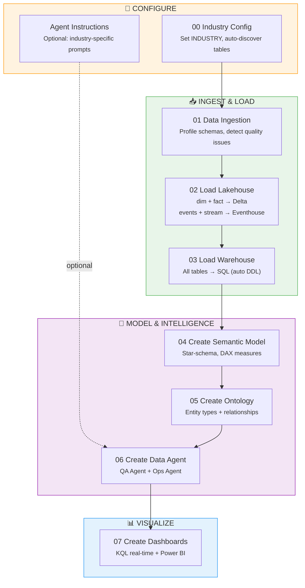
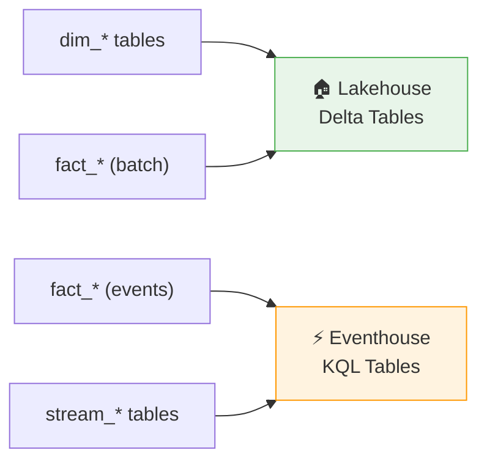

# Cross-Industry Accelerator — Notebook Pipeline

> **8 notebooks. Any industry. Full Fabric IQ deployment.**

Change one `INDUSTRY` variable and the entire pipeline adapts — data ingestion, Lakehouse/Warehouse loading, semantic model, ontology, AI agents, and dashboards.

---

## Before You Start — Checklist

Complete these prerequisites before running any notebook:

- [ ] **Fabric workspace** with capacity assigned (F2+ recommended)
- [ ] **Lakehouse** created in the workspace
- [ ] **Warehouse** created in the workspace
- [ ] **Eventhouse** created (with a KQL database) — for real-time streaming tables
- [ ] **CSV data files** uploaded to Lakehouse `Files/<industry>_data/`
- [ ] **Ontology package** (`.iq` file) uploaded to Lakehouse `Files/` *(needed at Step 5)*
- [ ] **fabriciq_ontology_accelerator** `.whl` uploaded to Lakehouse `Files/` *(needed at Step 5)*

<details>
<summary><b>How should my Lakehouse Files look?</b> (click to expand)</summary>

```
Files/
├── fabriciq_ontology_accelerator-0.1.0-py3-none-any.whl
├── <industry>_ontology_package.iq
└── <industry>_data/
    ├── dim_workers.csv
    ├── dim_clients.csv
    ├── fact_documentation_events.csv
    ├── stream_realtime_alerts.csv
    └── ... (23–25 CSV files total)
```

</details>

---

## Pick Your Industry

| Industry | Config Notebook | Tables | Dataset Folder |
|----------|----------------|--------|----------------|
| 🏥 Healthcare | `Healthcare_Config.ipynb` | 25 | `healthcare_nursing_documentation/` |
| 🏗️ Construction | `Construction_Config.ipynb` | 23 | `construction_site_operations/` |
| 💰 Finance | `Finance_Config.ipynb` | 23 | `finance_banking_operations/` |
| 🛒 Retail | `Retail_Config.ipynb` | 23 | `retail_store_operations/` |
| 📡 Telecom | `Telecom_Config.ipynb` | 23 | `telecom_network_operations/` |
| 🛡️ Insurance | `Insurance_Config.ipynb` | 23 | `insurance_claims_operations/` |
| ⚖️ Law Firms | `LawFirms_Config.ipynb` | 23 | `law_firm_operations/` |
| 📺 Media | `Media_Config.ipynb` | 23 | `media_content_operations/` |
| 🛢️ Oil & Gas | `OilAndGas_Config.ipynb` | 23 | `oil_gas_field_operations/` |
| 📢 Advertising | `Advertising_Config.ipynb` | 23 | `advertising_campaign_operations/` |

> **Tip:** Each config notebook is pre-filled with table names, KQL mappings, and expected row counts. Use it **instead of** `00_Industry_Config.ipynb` for a faster start.

---

## Pipeline Overview



> **Every notebook** automatically loads `ZT_Security_Utils.ipynb` for Zero Trust security — input validation, injection defense, and audit logging.

---

## Step-by-Step Guide

### Step 0 — Configure Your Industry

**Open:** `00_Industry_Config.ipynb` (or use a pre-filled config like `Retail_Config.ipynb`)

```python
INDUSTRY = "healthcare"  # ← Change this to your target industry key
```

**You must also set these** (found in Eventhouse → Overview):
```python
EVENTHOUSE_CLUSTER_URI = "https://<name>.<region>.kusto.fabric.microsoft.com"
EVENTHOUSE_DATABASE    = "<your_kql_database_name>"
```

**Run all cells.** The notebook will:

| What Happens | Output |
|-------------|--------|
| Auto-names all Fabric artifacts | `LAKEHOUSE_NAME`, `WAREHOUSE_NAME`, `ONTOLOGY_NAME`, etc. |
| Scans CSV folder | Classifies files as `dim_*`, `fact_*` (batch/event), `stream_*` |
| Shows discovery summary | Table counts, row counts, load targets |

> **Using a pre-filled config?** It already contains hardcoded table names and row counts — no auto-discovery needed.

---

### Step 1 — Data Ingestion & Validation

**Open:** `01_Data_Ingestion.ipynb` → **Run all cells**

| What It Does | Details |
|-------------|---------|
| Infers schemas | Reads every CSV, detects column types |
| Profiles columns | Null %, distinct values, numeric ranges |
| Flags quality issues | >50% nulls = 🔴 HIGH, >20% = 🟡 MEDIUM |
| Generates data catalog | Column-level details for every table |
| Produces load plan | Which tables go to Lakehouse vs. Eventhouse |

> **This step is read-only** — no data is moved. Review the quality report before proceeding.

---

### Step 2 — Load Lakehouse + Eventhouse

**Open:** `02_Load_Lakehouse.ipynb` → **Attach your Lakehouse** → **Run all cells**



> **No Eventhouse?** If `EVENTHOUSE_CLUSTER_URI` is not set, Eventhouse loading is skipped gracefully — Lakehouse tables still load.

---

### Step 3 — Load Warehouse

**Open:** `03_Load_Warehouse.ipynb` → **Run all cells**

All tables (dimensions, facts, events, streaming) are consolidated into the Warehouse with auto-generated DDL.

<details>
<summary><b>Spark → SQL type mapping</b> (click to expand)</summary>

| Spark Type | SQL Type |
|-----------|----------|
| StringType | NVARCHAR(4000) |
| IntegerType | INT |
| LongType | BIGINT |
| FloatType / DoubleType | FLOAT |
| BooleanType | BIT |
| DateType | DATE |
| TimestampType | DATETIME2 |
| DecimalType(p,s) | DECIMAL(p,s) |

</details>

---

### Step 4 — Create Semantic Model

**Open:** `04_Create_Semantic_Model.ipynb` → **Run all cells**

| What It Does | How |
|-------------|-----|
| Builds TMSL definition | Reads schemas from all CSVs |
| Detects relationships | FK `_id` columns → matching dim PK columns |
| Generates DAX measures | `SUM`, `AVERAGE` for numeric fact columns |
| Creates model in Fabric | Via REST API from Lakehouse or Warehouse |

> **Source control:** Set `SEMANTIC_MODEL_SOURCE` to `"lakehouse"` or `"warehouse"` depending on your preference.

---

### Step 5 — Create Ontology

**Open:** `05_Create_Ontology.ipynb` → **Run all cells**

| Mode | Set `ONTOLOGY_MODE` to | Input File |
|------|----------------------|------------|
| **Package** *(recommended)* | `"package"` | `.iq` ontology package |
| **RDF/OWL** | `"rdf"` | `.rdf` / `.owl` file |

The notebook automatically resolves Lakehouse, Eventhouse, and Semantic Model item IDs from the workspace — you only need the display names.

---

### Step 6 — Create Data Agents

**Open:** `06_Create_Data_Agent.ipynb` → **Run all cells**

Creates two AI agents linked to the ontology:

| Agent | Purpose | Example Question |
|-------|---------|-----------------|
| **QA Agent** | Ad-hoc data questions | *"Which workers had the most overtime this month?"* |
| **Ops Agent** | Event monitoring & alerts | *"Show me burnout risk trends by unit"* |

> **Better agent responses:** Run the matching `*_Agent_Instructions.ipynb` (e.g., `Retail_Agent_Instructions.ipynb`) **before** this step. It provides industry-specific schema context, sample queries, and operational thresholds.

---

### Step 7 — Create Dashboards

**Open:** `07_Create_Dashboards.ipynb` → **Run all cells**

Creates two dashboard types:

| Dashboard | Technology | Refresh | Content |
|-----------|-----------|---------|---------|
| **Real-Time Dashboard** | KQL Dashboard | 30-second auto-refresh | Timecharts, pie charts, trend lines, live event feeds |
| **Analytics Report** | Power BI (PBIR-Legacy) | On-demand | Executive summary, per-table KPI cards, drill-down pages |

> **Fallback:** If automated creation fails, the notebook outputs all KQL queries and TMSL JSON for manual creation.

---

## Files in This Folder

```
cross_industry_notebooks/
│
├── 00_Industry_Config.ipynb         # Universal auto-discovery config
├── 01_Data_Ingestion.ipynb          # Schema profiling & quality checks
├── 02_Load_Lakehouse.ipynb          # Lakehouse + Eventhouse loading
├── 03_Load_Warehouse.ipynb          # Warehouse loading with auto DDL
├── 04_Create_Semantic_Model.ipynb   # Power BI semantic model
├── 05_Create_Ontology.ipynb         # Fabric IQ ontology
├── 06_Create_Data_Agent.ipynb       # QA + Ops agents
├── 07_Create_Dashboards.ipynb       # KQL + Power BI dashboards
│
├── ZT_Security_Utils.ipynb          # 🔒 Zero Trust security (auto-loaded)
│
├── *_Config.ipynb                   # Pre-filled industry configs (10)
├── *_Agent_Instructions.ipynb       # Agent prompts per industry (10)
│
├── DASHBOARD_VISUALS_README.md      # Detailed visual specs for dashboards
└── README.md                        # ← You are here
```

---

## Configuration Reference

All variables are set in `00_Industry_Config.ipynb` and inherited by every downstream notebook via `%run ./00_Industry_Config`.

<details>
<summary><b>Full variable reference</b> (click to expand)</summary>

| Variable | Description | Example |
|----------|-------------|---------|
| `INDUSTRY` | Industry key | `"healthcare"` |
| `INDUSTRY_LABEL` | Display label (auto-derived) | `"Healthcare"` |
| `CSV_BASE_PATH` | CSV file path in Lakehouse | `/lakehouse/default/Files/healthcare_data` |
| `LAKEHOUSE_NAME` | Lakehouse name | `Healthcare_Data_Bronze` |
| `WAREHOUSE_NAME` | Warehouse name | `Healthcare_Datawarehouse` |
| `EVENTHOUSE_NAME` | Eventhouse name | `healthcare_rt_store` |
| `EVENTHOUSE_CLUSTER_URI` | Eventhouse endpoint | `https://...kusto.fabric.microsoft.com` |
| `EVENTHOUSE_DATABASE` | Eventhouse DB name | *(your DB name)* |
| `ONTOLOGY_NAME` | Ontology item name | `HealthcareDocBurdenOntology` |
| `DATA_AGENT_NAME` | QA Agent name | `HealthcareQA` |
| `OPS_AGENT_NAME` | Ops Agent name | `HealthcareDocBurden` |
| `SEMANTIC_MODEL_NAME` | Power BI model name | `Healthcare_DocBurden_Model` |

</details>

### Auto-Discovered Table Lists

These are populated by `discover_data_sources()` in the config notebook:

| Variable | Contents | Destination |
|----------|----------|-------------|
| `DIM_TABLES` | All `dim_*` CSV files | Lakehouse + Warehouse |
| `FACT_TABLES_BATCH` | `fact_*` CSVs (batch) | Lakehouse + Warehouse |
| `FACT_TABLES_EVENT` | `fact_*` CSVs (event) | Eventhouse + Warehouse |
| `STREAM_TABLES` | All `stream_*` CSV files | Eventhouse only |

> **Auto-detection:** Fact tables with event keywords (`_events`, `_clickstream`, `_alerts`, `_vital`) are automatically classified as event-level and routed to Eventhouse.

---

## Troubleshooting

<details>
<summary><b>Common Issues & Fixes</b> (click to expand)</summary>

| Problem | Fix |
|---------|-----|
| `ERROR: Path not found` | Upload CSVs to `Files/<industry>_data/` in your Lakehouse |
| Eventhouse cells skipped | Set `EVENTHOUSE_CLUSTER_URI` and `EVENTHOUSE_DATABASE` in notebook 00 |
| Ontology creation fails | Ensure `.whl` and `.iq` files are uploaded to Lakehouse `Files/` |
| Warehouse DDL errors | Verify the Warehouse exists and notebook has connectivity |
| Semantic model API error | Import the TMSL JSON manually via Power BI Desktop as fallback |
| Agent creation 403 | Workspace permissions must be **Contributor** or higher |
| No tables discovered | CSV files must start with `dim_`, `fact_`, or `stream_` |

</details>
