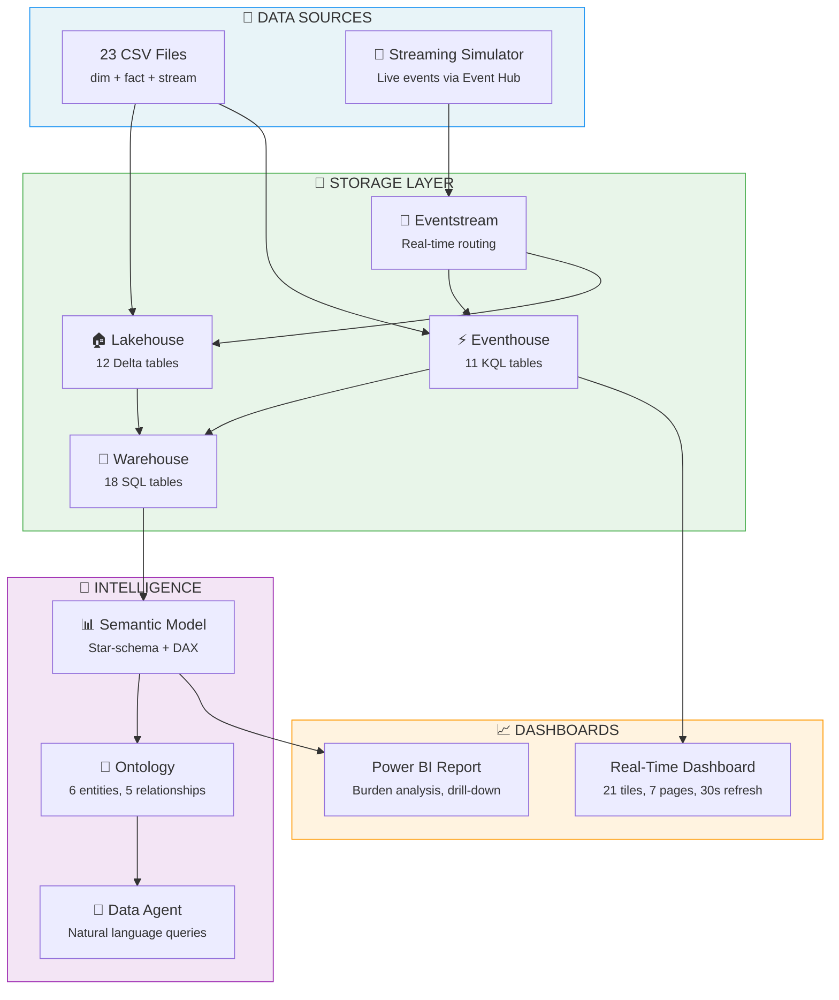
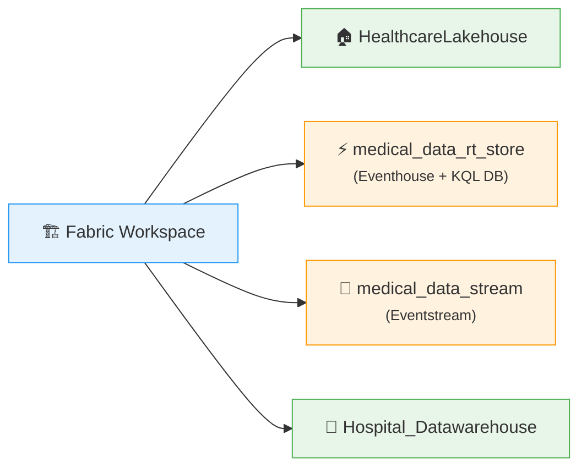
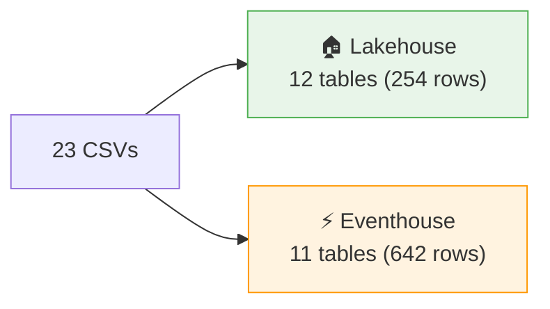
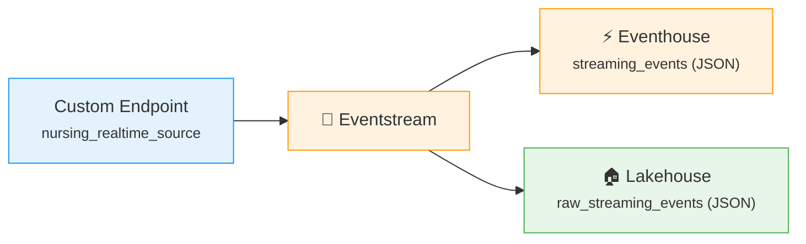
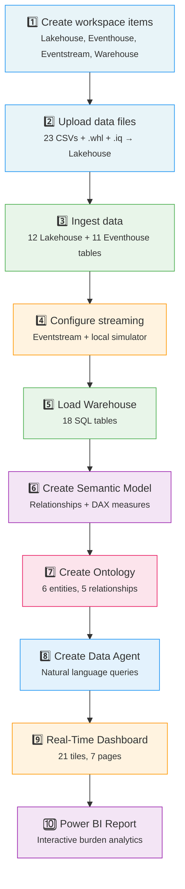

# Healthcare Nursing Documentation Burden — Setup Guide

> **Complete walkthrough:** From empty workspace to live dashboards with streaming data.

This guide deploys the full Healthcare Nursing Documentation Burden demo in Microsoft Fabric — including real-time streaming via a local simulator.

---

## What You'll Build



---

## Prerequisites

| Requirement | Details |
|---|---|
| **Fabric Workspace** | With Fabric capacity (F2+) enabled |
| **Fabric IQ Accelerator** | [Download `.whl`](https://github.com/microsoft/fabriciq-accelerator/releases) |
| **Ontology Package** | `healthcare_nursing_ontology_package.iq` (from samples or custom-built) |
| **Python 3.9+** | For the streaming simulator (Step 4 only) |
| **Azure CLI / Browser Auth** | For dashboard API scripts (Step 9 only) |

---

## Setup Checklist

Use this to track your progress through all 10 steps:

- [ ] **Step 1** — Create workspace items (Lakehouse, Eventhouse, Eventstream, Warehouse)
- [ ] **Step 2** — Upload CSV data + `.whl` + `.iq` to Lakehouse
- [ ] **Step 3** — Run data ingestion notebook (12 Lakehouse + 11 Eventhouse tables)
- [ ] **Step 4** — Configure Eventstream + run streaming simulator
- [ ] **Step 5** — Load Warehouse (18 tables)
- [ ] **Step 6** — Create Semantic Model + relationships + DAX measures
- [ ] **Step 7** — Create Ontology (from package or RDF)
- [ ] **Step 8** — Create Data Agent
- [ ] **Step 9** — Create Real-Time KQL Dashboard
- [ ] **Step 10** — Create Power BI Report

---

## Fabric Artifacts You Will Create

| Artifact | Type | Suggested Name |
|---|---|---|
| Lakehouse | Lakehouse | `HealthcareLakehouse` |
| Eventhouse | Eventhouse + KQL DB | `medical_data_rt_store` |
| Eventstream | Eventstream | `medical_data_stream` |
| Warehouse | Data Warehouse | `Hospital_Datawarehouse` |
| Semantic Model | Semantic Model | `Healthcare_Documentation_Model` |
| Ontology | Fabric IQ Ontology | `NursingDocBurdenOntology` |
| Data Agent | Fabric IQ Data Agent | `NursingDocAgent` |
| Real-Time Dashboard | KQL Dashboard | `Healthcare Nursing Operations` |
| Power BI Report | Power BI Report | `Healthcare Documentation Burden Report` |

---

## Connection Details — Master Reference

> **Save these values** as you create each artifact. You'll need them across multiple steps.

<details>
<summary><b>Where to find each value</b> (click to expand)</summary>

| Placeholder | Where to Find It | Used In |
|---|---|---|
| `<YOUR_EVENTHOUSE_CLUSTER_URI>` | Eventhouse → Overview → URI | Steps 3, 7, 9 |
| `<YOUR_DATABASE_ID>` | Eventhouse → KQL Database → Properties → ID | Step 9 |
| `<YOUR_WORKSPACE_ID>` | Workspace → Settings → Workspace ID | Step 9 |
| Lakehouse name | Display name of your Lakehouse | Step 7 |
| Eventhouse name | Display name of your Eventhouse | Step 7 |
| KQL database name | Name inside your Eventhouse | Steps 3, 7 |
| `EVENT_HUB_CONNECTION_STRING` | Eventstream → Custom Endpoint → Keys | Step 4 |
| `EVENT_HUB_NAME` | Eventstream → Custom Endpoint → Keys | Step 4 |

</details>

---

## Step-by-Step Setup

### Step 1 — Create Fabric Workspace Items

In your Fabric workspace, create these four items:



> **Note down the Eventhouse cluster URI** from the Eventhouse overview page — you'll need it in Steps 3, 7, and 9.

---

### Step 2 — Upload Data Files

Upload everything to the Lakehouse:

1. Open `HealthcareLakehouse` → **Files**
2. Create folder: `healthcare_data/`
3. Upload all 23 CSVs from `datasets/healthcare_nursing_documentation/data/`
4. Upload `fabriciq_ontology_accelerator-*.whl` to `Files/` root
5. Upload `healthcare_nursing_ontology_package.iq` to `Files/` root

**Your Lakehouse Files should look like:**
```
Files/
├── fabriciq_ontology_accelerator-0.1.0-py3-none-any.whl
├── healthcare_nursing_ontology_package.iq
└── healthcare_data/
    ├── dim_nurses.csv
    ├── dim_patients.csv
    ├── dim_hospital_units.csv
    ├── dim_documentation_types.csv
    ├── dim_medications.csv
    ├── dim_diagnoses.csv
    ├── fact_documentation_events.csv
    ├── fact_medication_administration.csv
    ├── ... (more fact tables)
    ├── stream_rtls_location.csv
    ├── stream_ehr_clickstream.csv
    ├── stream_nurse_call_events.csv
    ├── stream_bcma_scans.csv
    └── stream_clinical_alerts.csv
```

---

### Step 3 — Ingest Data into Lakehouse & Eventhouse

**Notebook:** `Healthcare_Generate_Ontology_Data.ipynb`

This loads all 23 CSVs into two storage layers:



**Configuration required (Cell 3):**
```python
eventhouse_cluster_uri = "<YOUR_EVENTHOUSE_CLUSTER_URI>"   # From Step 1
eventhouse_database     = "medical_data_rt_store"          # KQL database name
```

**Run:** Open in Fabric → Attach `HealthcareLakehouse` → Fill in variables → Run all cells.

---

### Step 4 — Set Up Real-Time Streaming

This step connects the Eventstream to receive live data from the simulator and routes it to both Eventhouse and Lakehouse.

**Notebook (instructions):** `Configure_Eventstream_Routing.ipynb`

#### 4a — Configure Eventstream in Fabric



1. Open `medical_data_stream` in Fabric
2. **Add source:** Custom Endpoint → name it `nursing_realtime_source`
3. **Add destination 1:** Eventhouse → `medical_data_rt_store` → table `streaming_events` (JSON)
4. **Add destination 2:** Lakehouse → `Hospital_Data_Bronze` → table `raw_streaming_events` (JSON)
5. Click **Activate** on each destination
6. **Copy** the Event Hub connection string and name from Custom Endpoint → Keys

#### 4b — Run the Simulator (local machine)

```bash
cd datasets/healthcare_nursing_documentation/simulator

# Install dependencies
pip install -r requirements.txt

# Create .env from template
cp .env.example .env
# ✏️ Edit .env — paste connection string and Event Hub name from Step 4a

# Run the simulator
python stream_simulator.py
# Optional: python stream_simulator.py --interval 0.3 --loops 5
```

The simulator replays 5 streaming CSVs as live events:
- `stream_rtls_location` — Nurse location tracking
- `stream_ehr_clickstream` — EHR system interactions
- `stream_nurse_call_events` — Call button events
- `stream_bcma_scans` — Medication barcode scans
- `stream_clinical_alerts` — Clinical alert triggers

**`.env` file format:**
```
EVENT_HUB_CONNECTION_STRING=Endpoint=sb://<namespace>.servicebus.windows.net/;SharedAccessKeyName=<key_name>;SharedAccessKey=<key>;EntityPath=<entity>
EVENT_HUB_NAME=<your_event_hub_name>
```

---

### Step 5 — Load the Data Warehouse

**Notebook:** `Load_Warehouse_Tables.ipynb`

Creates 18 tables in the warehouse with proper SQL types from the healthcare CSVs.

**Configuration required (Cell 1):**
```python
WAREHOUSE_NAME = "Hospital_Datawarehouse"    # Your warehouse name
SCHEMA_NAME    = "dbo"                       # Target schema
CSV_BASE_PATH  = "Files/healthcare_data"     # Path in attached Lakehouse
```

**Run:** Attach `HealthcareLakehouse` → Verify warehouse name → Run all cells.

**Result:** 18 tables (6 dimension + 12 fact) in `Hospital_Datawarehouse`.

---

### Step 6 — Create the Semantic Model

1. Open `Hospital_Datawarehouse` in Fabric
2. Click **New semantic model** → Name: `Healthcare_Documentation_Model`
3. Select all 18 tables → Click **Create**

#### Configure Relationships

Open the semantic model in the web modeling view and create these relationships:

<details>
<summary><b>All relationships</b> (click to expand)</summary>

| From Table | Column | To Table | Column | Cardinality |
|---|---|---|---|---|
| `fact_documentation_events` | `nurse_id` | `dim_nurses` | `nurse_id` | Many-to-One |
| `fact_documentation_events` | `patient_id` | `dim_patients` | `patient_id` | Many-to-One |
| `fact_documentation_events` | `doc_type_id` | `dim_documentation_types` | `doc_type_id` | Many-to-One |
| `fact_medication_administration` | `nurse_id` | `dim_nurses` | `nurse_id` | Many-to-One |
| `fact_medication_administration` | `patient_id` | `dim_patients` | `patient_id` | Many-to-One |
| `fact_medication_administration` | `medication_id` | `dim_medications` | `medication_id` | Many-to-One |
| `fact_vital_signs` | `nurse_id` | `dim_nurses` | `nurse_id` | Many-to-One |
| `fact_vital_signs` | `patient_id` | `dim_patients` | `patient_id` | Many-to-One |
| `fact_assessments` | `nurse_id` | `dim_nurses` | `nurse_id` | Many-to-One |
| `fact_assessments` | `patient_id` | `dim_patients` | `patient_id` | Many-to-One |
| `fact_shifts` | `nurse_id` | `dim_nurses` | `nurse_id` | Many-to-One |
| `fact_patient_encounters` | `patient_id` | `dim_patients` | `patient_id` | Many-to-One |
| `fact_patient_encounters` | `unit_id` | `dim_hospital_units` | `unit_id` | Many-to-One |
| `fact_burnout_surveys` | `nurse_id` | `dim_nurses` | `nurse_id` | Many-to-One |
| `fact_patient_satisfaction` | `patient_id` | `dim_patients` | `patient_id` | Many-to-One |
| `fact_patient_satisfaction` | `unit_id` | `dim_hospital_units` | `unit_id` | Many-to-One |
| `fact_documentation_quality` | `nurse_id` | `dim_nurses` | `nurse_id` | Many-to-One |
| `fact_documentation_quality` | `patient_id` | `dim_patients` | `patient_id` | Many-to-One |
| `fact_handoff_reports` | `outgoing_nurse_id` | `dim_nurses` | `nurse_id` | Many-to-One |
| `fact_ehr_interactions` | `nurse_id` | `dim_nurses` | `nurse_id` | Many-to-One |

</details>

#### Add Key DAX Measures

```dax
Total Documentation Time = SUM(fact_documentation_events[duration_min])

Avg Charting Time Per Shift = DIVIDE(
    [Total Documentation Time],
    DISTINCTCOUNT(fact_shifts[shift_id])
)

Documentation Burden % = DIVIDE(
    [Total Documentation Time],
    SUM(fact_shifts[actual_duration_min])
)

Burnout Risk Score = AVERAGE(fact_burnout_surveys[emotional_exhaustion])

Patient Satisfaction Avg = AVERAGE(fact_patient_satisfaction[overall_rating])
```

---

### Step 7 — Create the Fabric IQ Ontology

The ontology maps data to entity types, relationships, and contextualizations for the Data Agent.

**Recommended: From Package**

**Notebook:** `Healthcare_Create_Ontology_from_Package.ipynb`

**Configuration required (Cell 2):**
```python
binding_lakehouse_name           = "HealthcareLakehouse"
binding_eventhouse_name          = "medical_data_rt_store"
binding_eventhouse_cluster_uri   = "<YOUR_EVENTHOUSE_CLUSTER_URI>"
binding_eventhouse_database_name = "medical_data_rt_store"
```

> The notebook auto-resolves Lakehouse and Eventhouse IDs — you only provide display names + cluster URI.

**Run:** Attach `HealthcareLakehouse` → Fill in bindings → Run all cells.

<details>
<summary><b>Alternative: From RDF/OWL</b></summary>

**Notebook:** `Healthcare_Create_Ontology_from_RDF.ipynb`

Defines the full ontology inline using RDF/OWL. Use this to customize the ontology structure before creating it.

</details>

**Ontology Structure:**

| Component | Count | Examples |
|---|---|---|
| Entity Types | 6 | Nurse, Patient, HospitalUnit, DocumentationType, Medication, Diagnosis |
| Relationship Types | 5 | assigned_to, admitted_to, has_diagnosis, cares_for, prescribes_for |
| Contextualizations | 6–11 | DocumentationEvent, MedicationAdministration, VitalSignsRecording, etc. |

---

### Step 8 — Create the Data Agent

1. In your Fabric workspace → **+ New** → **Data Agent**
2. Name: `NursingDocAgent`
3. Data source: select `NursingDocBurdenOntology`
4. Click **Create**

**Test queries to try:**
- *"Which nurses had the most overtime this month?"*
- *"Show me documentation burden by unit"*
- *"What is the correlation between charting time and burnout scores?"*
- *"List patients in ICU with the most medication administration events"*

---

### Step 9 — Create the Real-Time Dashboard

The Real-Time Dashboard shows live streaming data — 21 KQL tiles across 7 pages.

#### Option A — Auto-generate via script *(recommended)*

```bash
cd fabriciq-nurse-doc-burden-usecase

# 1. Edit variables at top of generate_dashboard.py:
#    CLUSTER_URI  = "<YOUR_EVENTHOUSE_CLUSTER_URI>"
#    DATABASE_ID  = "<YOUR_DATABASE_ID>"
#    WORKSPACE_ID = "<YOUR_WORKSPACE_ID>"

python generate_dashboard.py           # Produces Healthcare_Nursing_Dashboard.json

# 2. Push to Fabric
pip install azure-identity requests
python create_dashboard_api.py         # Authenticates via browser, creates dashboard
```

#### Option B — Build manually

All 21 KQL queries are available in `Healthcare_RT_Dashboard_Queries.kql` which you can use to manually create the dashboard tiles.

**Dashboard Pages:**

| Page | Tiles | Focus |
|------|-------|-------|
| Overview | 3 | Event volume, stream breakdown, timeline |
| Nurse Location | 3 | Zone time, movement patterns, floor activity |
| EHR Clickstream | 3 | Screen usage, click patterns, navigation |
| Nurse Calls | 3 | Call volume, response times, escalations |
| BCMA / Medication | 3 | Scan rates, override tracking, verification |
| Clinical Alerts | 3 | Alert types, severity, response times |
| Workload | 3 | Nurse workload balance, doc vs care time |

---

### Step 10 — Create the Power BI Report

1. Open `Healthcare_Documentation_Model` → Click **Create report**
2. Build these suggested pages:

| Page | Key Visuals | Metrics |
|------|------------|---------|
| **Documentation Burden Overview** | KPI cards, bar chart, line chart | Total charting time, avg per shift, burden %, by doc type |
| **Nurse-Level Analysis** | Matrix, scatter plot | Charting time by nurse, overtime vs burnout |
| **Unit Comparison** | Stacked bar, KPI cards | Burden and satisfaction by hospital unit |
| **Burnout Correlation** | Scatter + trendline, heatmap | Exhaustion vs charting hours, by experience |
| **Patient Impact** | Combo chart, table | Satisfaction vs burden, by unit |
| **Medication & Care** | Bar chart, timeline | Med admin patterns, vital signs frequency |

**Key visual ideas:**
- **Scatter:** `emotional_exhaustion` (Y) vs. documentation hours (X), sized by `years_experience`
- **Bar chart:** Documentation time by `doc_type`, colored by `category`
- **Line chart:** Overtime trend from `fact_shifts` over time

---

## Pipeline Summary



---

## File Reference

<details>
<summary><b>All files and which step uses them</b> (click to expand)</summary>

| File | Purpose | Step |
|---|---|---|
| `data/*.csv` (23 files) | Source data — dims, facts, streaming | 2, 3 |
| `Healthcare_Generate_Ontology_Data.ipynb` | Loads CSVs into Lakehouse + Eventhouse | 3 |
| `Configure_Eventstream_Routing.ipynb` | Eventstream routing instructions | 4 |
| `simulator/stream_simulator.py` | Live streaming events | 4 |
| `simulator/.env.example` | Event Hub credential template | 4 |
| `simulator/requirements.txt` | Simulator Python deps | 4 |
| `Load_Warehouse_Tables.ipynb` | Creates 18 warehouse tables | 5 |
| `Healthcare_Create_Ontology_from_Package.ipynb` | Ontology from `.iq` package | 7 |
| `Healthcare_Create_Ontology_from_RDF.ipynb` | Ontology from RDF/OWL (alt) | 7 |
| `generate_dashboard.py` | Generates dashboard JSON | 9 |
| `create_dashboard_api.py` | Pushes dashboard to Fabric | 9 |
| `Healthcare_Nursing_Dashboard.json` | Pre-built dashboard definition | 9 |
| `Healthcare_RT_Dashboard_Queries.kql` | All 21 KQL queries | 9 |

</details>

---

## Troubleshooting

<details>
<summary><b>Common Issues & Fixes</b> (click to expand)</summary>

| Problem | Fix |
|---------|-----|
| Eventhouse ingestion fails | Verify cluster URI (Eventhouse → Overview). Ensure KQL database exists. |
| Simulator connection refused | Check `.env` has full `Endpoint=sb://...` connection string. Ensure Eventstream Custom Endpoint is active. |
| Warehouse table creation fails | Ensure warehouse exists and notebook's default Lakehouse has the CSVs. Check name matches `WAREHOUSE_NAME`. |
| Ontology creation 400 error | Lakehouse and Eventhouse names must match exactly (case-sensitive). Verify `.iq` and `.whl` are uploaded. |
| Dashboard data source error | Cluster URI, database ID, and workspace ID in `generate_dashboard.py` must match your Eventhouse. |
| No streaming data in dashboard | Run simulator (Step 4b) first. Check Eventstream destinations are activated. Test: `streaming_events \| count` |
| Semantic model missing relationships | Create relationships manually (Step 6). Column names must match between fact and dim tables. |

</details>
